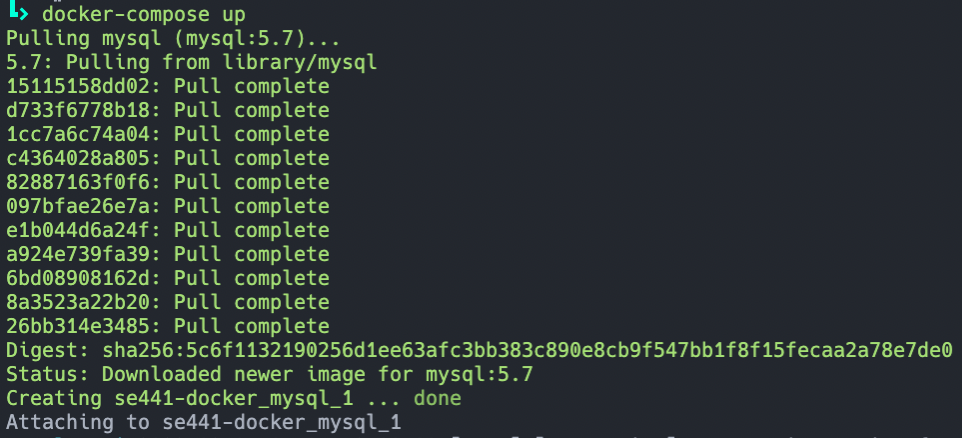

## Docker

[Dockerfile](Dockerfile)

## Docker Compose - MYSQL Only

## Docker Compose - App Server and MYSQL

[Docker Compose](docker-compose.yml)

[Application MySQL Properties](src/main/resources/application-mysql.properties)

